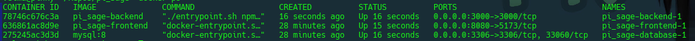
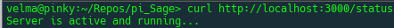

# Project Directive - pi_Sage

### Initial Considerations

- educating myself on common threats faced by system administrators and how to detect them. 

- how should we emulate a proper testing environment?

- emulating network threats to create anomolies for the application to catch. 

- building the app in a containerized environment (Docker) to make it cross platform, and easily deployable 

- legal issues with port scanning, and creating a virtual environment so that we can properly conduct testing 

## Initial Setup of Containerized environment

this is all setup to be run on a linux environment, but in theory any machine that can run docker-compose should be able to pull this repo and run it. In the future I plan to test this across as many platforms as allows.

### 1. We setup a project structure
    
```bash
mkdir pi_Sage
mkdir frontend backend
```
no need to create a database folder, as that's using a "Named Volume" which is managed by docker for simplicity. "They are stored in a directory on the host machine and can be easily accessed by multiple containers."[[1]](#1-harker-c-2023-march-29-docker-volumes-a-comprehensive-guide-divio-httpswwwdiviocomblogdocker-volumes-a-comprehensive-guide)

### 2. Make a basic docker-compose.yaml and docker files for frontend and backend
I created the docker-compose.yaml file, which will direct docker-compose on what containers it needs to setup. I have three services, one for a backend that runs nmap and the REST API, one for a frontend that runs vue.js and displays the data from nmap, and one for a mysql database for the sake of logging network captures, and user configuration

I made a file named "Dockerfile" in both the backend and frontend directories, these build custom node.js images for our frontend and backend. 


### 3 Setup backend
you just have to run a couple of commands to setup the backend. I navigated to the backend folder and ran 

The docker files for the backend and frontend should both pull from a node.js image. To setup a "filler" http server I created a file called index.js and put the following code inside it
&nbsp;  
&nbsp;  
&nbsp;  


```js
const http = require('http');

const server = http.createServer((req, res) => {
  res.end('Server is running idly...');
});

server.listen(3000, () => {
  console.log('Server listening on port 3000');
});
```

We must then edit our package.json file in the scripts section
we want to make sure we add a "start" script value and set it to a command to run index.js

```json
"scripts": {
    "test": "echo \"Error: no test specified\" && exit 1",
    "start": "node index.js"
  },

```

in our dockerfile we created earlier for the backend we declared that this command would run on startup of this container
```docker
CMD ["npm", "start"]
```
this is the equivalent of typing `npm start` into the terminal in the backend directory. in our package.json file we have to make sure to tell node.js (npm) what we want "start" to execute. You could call this our backends "main."

### 4. Setup a vue project in the frontend

```bash
npm create vue@latest
```

"This command will install and execute create-vue, the official Vue project scaffolding tool. You will be presented with prompts for several optional features such as TypeScript and testing support:"[[2]](#2-you-e-2021-august-31-vuejs-quick-start--vuejs-httpsvuejsorgguidequick-starthtml)


In the frontend I had to setup a "hello world" vue project for the docker container to run. I tested it on the host and it worked albeit having some weird syntax error in one of the pregen json files. I corrected this error and the project still functioned as expected.

had to edit the vite.config.ts to expose vue to the network (I chose to use typescript in this project)
&nbsp;  
&nbsp;  


```ts
server: {
    host: '0.0.0.0', // Allows access from outside the container
    port: 5173,      // This should match your EXPOSE in the Dockerfile
  }
```

### 5. Run `docker-compose up` in the root project directory and profit
at this point I just ran `docker-compose up` in the projects root directory, and followed the logs that came back in my console to find out where to go to ensure all the containers were behaving as intended. The vue container has been verified as working and accessible and a change made to the typescript file that handles configuration for vite. 

I still need to verify that the backend and database are working properly,  but I did ensure that the backend was up and running an http server that's listening on port 3000.

below you can see that all three containers are up and running on my systems terminal




the feedback from the logs for all three containers that indicated they are working properly

```

frontend-1  |   VITE v6.2.2  ready in 313 ms
frontend-1  | 
frontend-1  |   ➜  Local:   http://localhost:5173/
frontend-1  |   ➜  Network: http://172.20.0.4:5173/

backend-1   | > backend@1.0.0 start
backend-1   | > node index.js
backend-1   | 
backend-1   | Server listening on port 3000


database-1  | 2025-03-21T08:38:02.373465Z 0 [System] [MY-010931] [Server] /usr/sbin/mysqld: ready for connections. Version: '8.4.4'  socket: '/var/run/mysqld/mysqld.sock'  port: 3306  MySQL Community Server - GPL.
```


## Mitigation to Possible Testing Errors and Legal Issues With Port Scanning
"When used properly, Nmap helps protect your network from invaders. But when used improperly, Nmap can (in rare cases) get you sued, fired, expelled, jailed, or banned by your ISP."[[3]](#3-lyon-g-nd-legal-issues-nmap-network-scanning-legal-issues--nmap-network-scanning-httpsnmaporgbooklegal-issueshtml)

Make sure that you speak to a lawyer about these issues because listening to a Software Developer and Computer Science student isn't necessarily the best choice here. 

"Ensure that you have permission to scan. Probably at least 90% of network scanning is non-controversial. You are rarely badgered for scanning your own machine or the networks you administer. The controversy comes when scanning other networks."[[3]](#3-lyon-g-nd-legal-issues-nmap-network-scanning-legal-issues--nmap-network-scanning-httpsnmaporgbooklegal-issueshtml)

The rules here seem to be pretty simple, don't do anything controversial on any kind of work, school, or public connection. To try to further mitigate these issues, I will probably be testing the application in a virtual machine, on an isolated network. This is for safety reasons and to mitigate any chance of accidentally scanning the wrong thing. I will make sure to read the Nmap documentation thoroughly to ensure I am well aware of how to use the tool before I just start scanning ports willy nilly. at some point during local development I would like to possibly restrict it to only running scans on the local network. This would safeguard users from mistakes and misuse of the program. 

in theory we should be able to program the API to be lacking in that functionality without major modification. Any future users of this application have been warned of the possible legal ramifications of misuse of pi_Sage, nmap, nmap's API, or any future tools or APIs that may be introduced. 


## Further Exploring The Backend

### 1. Changing from normal http server to express server
we had to make some changes to our backend's `index.js` file. the updated code below is now going to be using express to build the HTTP server. Upon further research we may need more dependencies, such as a middleware, and the mysql dependencies. 

```js
const express = require('express');

const app =  express ();
app.use(express.json());

const http = require('http');
const PORT = process.env.PORT || 3000;

app.listen(PORT, ()=> {
  console.log("Server Listening on PORT: ", PORT);
})

app.get("/status", (request, response) => {
const status = {
  "Status": "Running"
};

response.send(status);
});
```

by running the below command we can test the server
 ```bash
 curl http://localhost:3000/status
```
this will give you `Server is running idly...` if it is up and running. To get more in depth information you can use the `-v` flag for verbose information. This was our first API Call. This was the first step in connecting all the pieces, and having a functional web application. At this point I branched off and modified the application to use typescript. 


### 2. Switching to Typescript


First I had to run[[4]](#4-adewakun-i-2024-june-4-using-sequelize-with-typescript-logrocket-blog-httpsbloglogrocketcomusing-sequelize-with-typescript)
```bash
npm add -D typescript ts-node @types/express @types/node
```

Then I had to make changes to the dockerfile, and to tsconfig.json and package,json. 

```dockerfile
#Docker Changes Must be added in after npm install
RUN npm run build 
```
```ts
//tsconfig.json changes
 "compilerOptions": {
  "target": "es2019",
  "allowJs": true,
  "checkJs": true,
  "outDir": "./"
  },
  "include": ["./**/*"],
  "exclude": ["node_modules"]
```
```js
//package.json changes
"scripts": {
  "build": "tsc",
  "start": "ts-node index.ts"
}
```

&nbsp;  
&nbsp;  
&nbsp;  
&nbsp;  
&nbsp;  
&nbsp;  
&nbsp;  
&nbsp;  
&nbsp;  
&nbsp;  


Now I had to replace the backend `index.js` file, with an `index.ts` file and adapt my backend code over to typescript.

```typescript
//backend code adapted to typescript
import express, { Request, Response } from 'express';

const app = express();
app.use(express.json());

const PORT = process.env.PORT || 3000;

app.listen(PORT, () => {
  console.log("Server Listening on PORT:", PORT);
});

app.get("/status", (request: Request, response: Response) => {
  response.send("Server is active and running...\n");
});
```

At this point the backend was setup to use typescript, and we had an active and running HTTP server



&nbsp;  
&nbsp;  
&nbsp;  
&nbsp;  
&nbsp;  
&nbsp;  
&nbsp;  
&nbsp;  
&nbsp;  
&nbsp;  
&nbsp;  
&nbsp;  
&nbsp;  
&nbsp;  
&nbsp;  
&nbsp;  
&nbsp;  
&nbsp;  
&nbsp;  
&nbsp;  
&nbsp;  
&nbsp;  
&nbsp;  
&nbsp;  

### 3. Setting up the router and nmapProcess

In this case we had to set up a "route" like we did with the status command. "routes" are essentially the websites structure. In this case we establish the app in index.ts and then we will make multiple routers, routing each router to it's own route in the app. This looks something like what I have below

```ts
/* /src/api/routes/scanRoute.ts */
import { runNmap } from "../services/nmapScanner";

import  { Request, Response, Router } from "express";

import dotenv from 'dotenv'

dotenv.config();
const localnetwork = process.env.LOCAL_NETWORK
const nMapRouter = Router();
nMapRouter.get( "/", async (req: Request, res: Response) => {   //here we create a router for all nmap requests in case we want 
    try {                                                       // to create subroutes for different scan options
        const result = await runNmap(localnetwork);
        res.send(result);
    } catch (error) {
        res.status(500).send(error);
    }
});

export default nMapRouter;
```

This line must be added to index.ts or these routes won't be resolved

```ts
app.use('/scan', nMapRouter);   // here we map the nMapRouter to /scan in the root project 
                                // so we can access it's functionality via insert-host-name:3000/scan
```

&nbsp;  
&nbsp;  
&nbsp;  
&nbsp;  
&nbsp;  
&nbsp;  
&nbsp;  
&nbsp;  
&nbsp;  
&nbsp;  
&nbsp;  


in another file we created a function that used spawn from child_process to handle running nmap and passing the data back to the request.[[5]](#5-nodejs-v23100-documentation-child-process--nodejs-v23100-documentation-nd-httpsnodejsorgapichild_processhtmlchild_processspawncommand-args-options)


```ts
import { spawn } from 'child_process';

export function runNmap(target: string | undefined): Promise<string> {
    return new Promise((resolve, reject) => {
        if(target == undefined){
            return reject(`Target is undefined`);     //error checking in case target is undefined
        }
        const command = 'nmap';
        // Add -vv for more verbosity if needed
        const args = ['-T4', '-v', '-sV', '-F',  target];
    
        const nmapProcess = spawn(command, args);
    
        let output = '';
        nmapProcess.stdout.on('data', (data) => {       //successfull output
          output += data.toString();
          console.log(data.toString());
        });
    
        nmapProcess.stderr.on('data', (data) => {       //stderr won't halt the process but will print an error to the console for debugging
          console.error(`Nmap stderr: ${data}`);
        });
    
        nmapProcess.on('error', (error) => {            // on an error we send a rejection carrying the error message. 
          reject(`Error: ${error.message}`);
        });
    
        nmapProcess.on('close', (code) => {             //if nmap exited with an error code reject with that code. 
          if (code !== 0) {
            return reject(`Nmap process exited with code ${code}`);
          }
          resolve(output);
        });
    });
}
```


&nbsp;  
&nbsp;  
&nbsp;  
&nbsp;  
&nbsp;  
&nbsp;  
&nbsp;  
&nbsp;  
&nbsp;  
&nbsp;  
&nbsp;  
&nbsp;  
&nbsp;  
&nbsp;  
&nbsp;  
&nbsp;  
&nbsp;  
&nbsp;  
&nbsp;  
&nbsp;  
&nbsp;  
&nbsp;  
&nbsp;  
&nbsp;  
&nbsp;  
&nbsp;  
&nbsp;  
&nbsp;  
&nbsp;  
&nbsp;  
&nbsp;  
&nbsp;  
&nbsp;  
&nbsp;  
&nbsp;  
&nbsp;  
&nbsp;  
&nbsp;  
&nbsp;  
&nbsp;  
&nbsp;  
&nbsp;  
&nbsp;  
&nbsp;  
&nbsp;  
&nbsp;  
&nbsp;  
&nbsp;  
&nbsp;  
&nbsp;  
&nbsp;  
&nbsp;  


# Biblio

### 1. Harker, C. (2023, March 29). *Docker volumes: A comprehensive guide.* Divio. [https://www.divio.com/blog/docker-volumes-a-comprehensive-guide/](https://www.divio.com/blog/docker-volumes-a-comprehensive-guide/) 

### 2. You, E. (2021, August 31). *Vue.js. Quick Start | Vue.js.* [https://vuejs.org/guide/quick-start.html](https://vuejs.org/guide/quick-start.html) 

### 3. Lyon, G. (n.d.). *Legal issues: Nmap network scanning. Legal Issues | Nmap Network Scanning.* [https://nmap.org/book/legal-issues.html](https://nmap.org/book/legal-issues.html) 

### 4. Adewakun, I. (2024, June 4). *Using sequelize with typescript. LogRocket Blog.* [https://blog.logrocket.com/using-sequelize-with-typescript/](https://blog.logrocket.com/using-sequelize-with-typescript/)

### 5. *Node.js V23.10.0 documentation. Child process | Node.js v23.10.0 Documentation. (n.d.).* [https://nodejs.org/api/child_process.html#child_processspawncommand-args-options](https://nodejs.org/api/child_process.html#child_processspawncommand-args-options)
