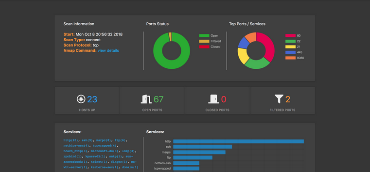
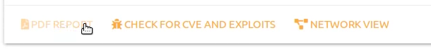

# List of UI features

There is an application called [webmap](https://cisotimes.com/web-dashboard-for-your-nmap-scans/), that is a web dashboard specifically for nmap scans. It lets you view previous nmap scans through a web dashboard to better visualize the results. The things we will be stealing will likely be from the UI and the things we will be adding will likely be backend functionality. 

# Features to take
 1. Pie Charts (Webmap)
 

 I really like the pie charts from webmap to show port status and what ports and services are being used the most. The biggest problem here is that we can't make a live scan from the web dashboard. With webmap we'd have to go back to our terminal and run the scan then upload the results. This could be remedied while taking the best things from their web dashboard.

 2. PDF Report(webmap)

I like the idea in both functionality and user experience to be able to press a button and export the results of the scan to a PDF. Not only does this make generating a visual report for the rest of a team easier, but it makes record keeping easier and more visual. 

3. Topology tab (zenmap)

best when used with 

