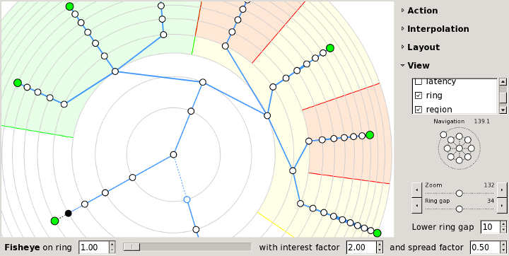

# List of UI features

There is an application called [webmap](https://cisotimes.com/web-dashboard-for-your-nmap-scans/), that is a web dashboard specifically for nmap scans. It lets you view previous nmap scans through a web dashboard to better visualize the results. The things we will be stealing will likely be from the UI and the things we will be adding will likely be backend functionality. 

The Prototype can be found [here](https://www.figma.com/proto/DrcVgnpxK8qWVftWTcmTh4/Untitled?node-id=4-498&p=f&t=idZ95TGk0Q10Y4kT-0&scaling=scale-down&content-scaling=fixed&page-id=0%3A1&starting-point-node-id=4%3A498)

## Features to take
 1. Pie Charts (Webmap)
 

 I really like the pie charts from webmap to show port status and what ports and services are being used the most. The biggest problem here is that we can't make a live scan from the web dashboard. With webmap we'd have to go back to our terminal and run the scan then upload the results. This could be remedied while taking the best things from their web dashboard.

 2. PDF Report(webmap)

I like the idea in both functionality and user experience to be able to press a button and export the results of the scan to a PDF. Not only does this make generating a visual report for the rest of a team easier, but it makes record keeping easier and more visual. 

3. Topology tab (zenmap)

adding a map of network topology to help the user visualize the network, and be bale to see each route of each connection made. 

## Features to add
1. Scan results (Webmap)

Feedback from the console from nmap will be necessary as we are performing the scan from the application, which is not something webmap lets you do. We want to be able to see the direct feedback from the console to aid in troubleshooting and providing the user with necessary information that the gui may hide. 

2. Modernized UI (Zenmap)

Zenmap's gui is very old looking, the web dashboard should aid us in making the application feel more visually appealing, and helping us to order the application better. Zenmap's gui can be very confusing with the way things are listed, so I hope to modernize and "dumb down" the use of nmap with this application, while properly safeguarding the user from accidentally scanning something they shouldn't. 

3. Removal of uneccessary UI elements (Webmap)

webmap seems to like it's donut charts. I can respect this, but the "port status" donut chart is kind of silly. I can't think of a time when I might need to know EVERY ports status without knowing the status of individual ports. This just isn't something I'd represent with a donut chart. If I find a valid replacement chart, then I will use that instead, but I have decided to omit this statistic for the time being. 